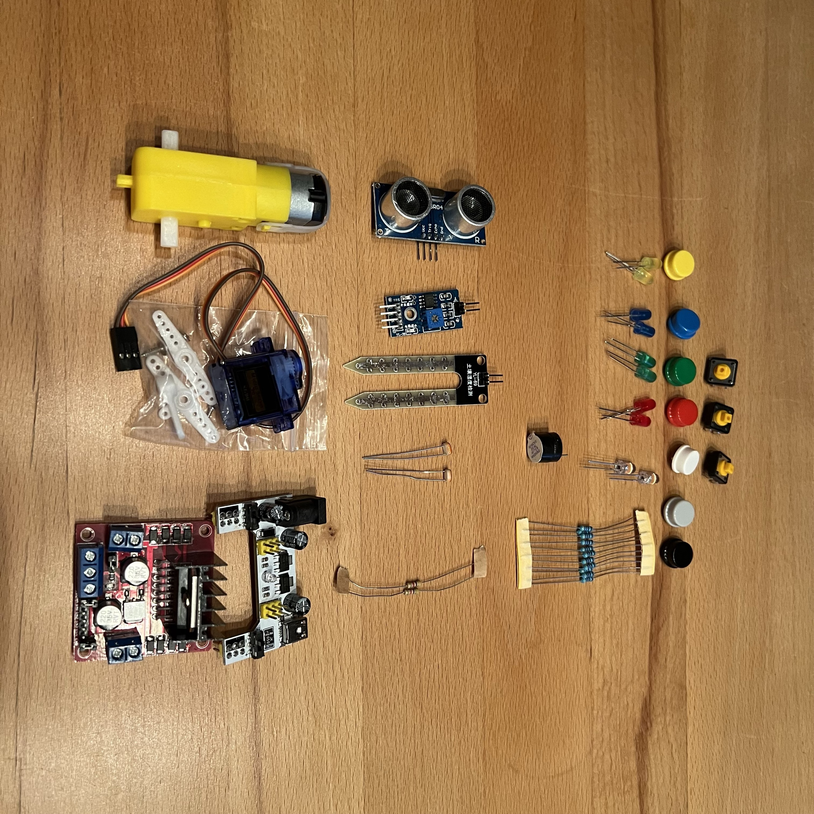

.. _sec-preparation:

Vorbereitungen
##############

.. contents::
    :local:

Was Ihr braucht
***************

Folgendes braucht jedes Team, um mitarbeiten zu können.

Bringt mit (jedes Team nur 1x):

- Einen Laptop mit Windows 7, 10 oder 11 [#]_.
- Ein passendes Netzteil.
- Eine Maus
- Rechte, auf dem Computer Software und Treiber zu installieren [#]_.

Weiterhin sollte jedes Team mitbringen:

- Eine Powerbank und/oder ein USB-Netzteil (USB-A).

.. attention::

    Ihr benötigt auf dem Computer Administrator-Rechte, um einen Treiber zu installieren, damit der
    Computer mit dem Arduino kommunzieren kann.

    Laptop

    Netzteil und Maus für den Laptop

    Powerbank. Die brauchen wir für den Arduino.

.. rubric:: Anmerkungen

.. [#] Der Computer benötigt mindestens einen "normalen" USB-Anschluss (USB-A). Falls Ihr nur einen
    ganz modernen Computer mit außschließlich USB-C-Anschlüssen habt, dann bringt bitte einen
    Adapter mit.

.. [#] Man nennt das auch "Administrator-Rechte". Wenn Ihr nicht wisst, ob Ihr die habt, dann schaut
    hilft auch Kapitel :ref:`sec-admin-rights` weiter.

Was Ihr bereitgestellt bekommt
******************************

... für die Trainingsphase
==========================

.. figure:: _figures/box-closed.png

    Arduiono-Entwicklungs-Kit

.. figure:: _figures/memory-stick.png

    Memory stick(s) mit Entwicklungs-Software und Arduino-Treiber

Unboxing
--------

.. figure:: _figures/box-opened.png

    Geöffnete Box

Die Box enthält:

- Ein kleiner Computer vom Typ "Arduino" ("Mikrocontroller")
- Ein Steckbrett
- Kabel zum Verbinden des Arduino mit dem Laptop

    Arduino auf Steckbrett und Kabel

- Kabel zum Verbinden des Arduino mit den anderen Bauteilen und den Bauteilen untereinander.

.. figure:: _figures/arduino-and-breadboard-and-cables.png

    Arduino mit Steckbrett und Kabel zum Verbinden mit dem Laptop.

Die Box enthält zusätzlich:

- Taster ("Buttons") mit farbigen Kappen
- LEDs in verschiedenen Farben
- Widerstände passend zu den LEDs

    Die weiteren Teile in der Box

... für die Projektphase
========================

.. todo:: Füge das Bastelmaterial und die Werkzeuge hier ein.

    Kleine Pumpe

.. figure:: _figures/raspberry-pi-4b-and-breadboard.png

    Raspberry Pi mit Kamera
