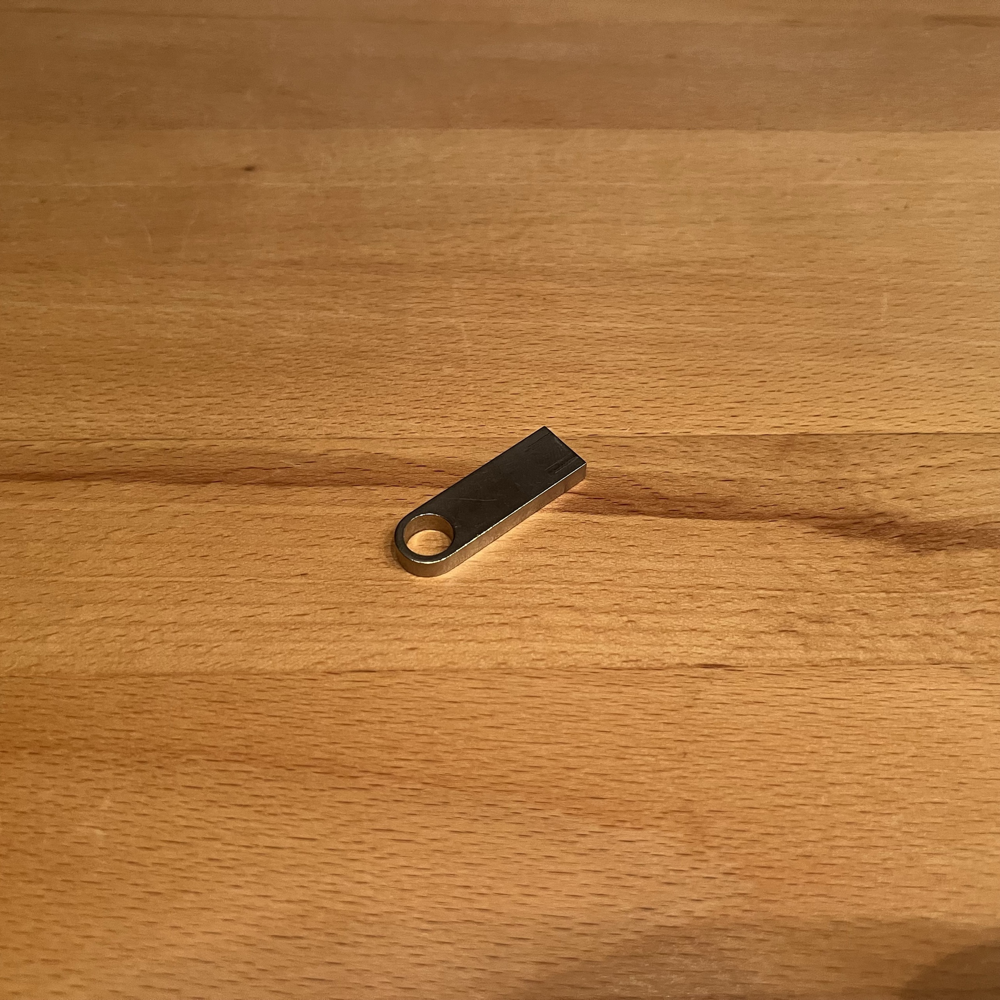

Vorbereitungen
##############

.. contents::
    :local:

Was Ihr braucht
***************

Folgendes braucht jedes Team, um mitarbeiten zu können.

Bringt mit (jedes Team nur 1x):

- Einen Laptop mit Windows 7, 10 oder 11.
- Ein passendes Netzteil.
- Eine Maus
- Der Computer benötigt mindestens einen "normalen" USB-Anschluss (USB-A).

Weiterhin sollte jedes Team mitbringen:

- Eine Powerbank und/oder ein USB-Netzteil (USB-A).

.. attention::

    Ihr benötigt auf dem Computer Administrator-Rechte, um einen Treiber zu installieren, damit der
    Computer mit dem Arduino kommunzieren kann.

.. figure:: _figures/laptop.png

    Laptop

.. figure:: _figures/laptop_accessories.png

    Utensilien für den Laptop

.. figure:: _figures/powerbank.png

    Powerbank

Was Ihr bereitgestellt bekommt
******************************

... für die Trainingsphase
==========================

    Arduiono-Entwicklungs-Kit

    Memory stick(s) mit Entwicklungs-Software und Arduino-Treiber

Unboxing
--------

    Geöffnete Box

.. figure:: _figures/arduino-and-breadboard.png

    Arduino mit Steckbrett

    Arduino mit Steckbrett und Kabel zum Verbinden mit dem Laptop.

.. figure:: _figures/box-content-auxiliary-parts.png

    Caption

    Caption

... für die Projektphase
========================

.. todo:: Füge das Bastelmaterial und die Werkzeuge hier ein.

.. figure:: _figures/pump.png

    Kleine Pumpe

    Raspberry Pi mit Kamera
