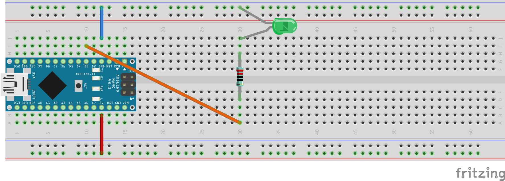

2. Übung - LED steuern
######################

Nun wollen wir die LED mit einem Programm steuern. Dafür müssen wir die Schaltung ändern zu folgender:

Wir haben also den Wiederstand von der 5V Leiste getrennt und über ein orangenes Kabel an den Pin D3 angeschlossen.

Die LED ist nun aus.

Wir schalten sie an indem wir folgendes Programm auf den Arduino hochladen:

.. code-block:: cpp

    void setup(){
        pinMode(3, OUTPUT);
        digitalWrite(3, HIGH);
    }
    
    void loop(){
    }

Ich erkläre mal genau dieses Programm und wie der Arduino dieses abarbeitet:

Nachdem der Arduino durch

- Anschließen an den Computer oder
- Anschließen an eine andere 5V Stromquelle (z.B. ein Handy-Landegerät) eingeschaltet oder
- ein neues Programm hochgeladen oder
- der kleine Reset-Knopf auf dem Arduino gedrückt

wurde, ruft er **einmalig** die **setup** Funktion auf.

Danach ruft er **immer wieder** die **loop** Funktion auf.

Innerhalb jeder Funktion führt er Befehl für Befehl nacheinander aus. Wir programmieren den Arduino übrigens in der Sprache namens C++.

In C++ müssen Befehle durch ein Semikolon (;) voneinander getrennt werden. Ansonsten nimmt der Compiler (das Programm, das unser Programm in für den Arduino ausführbare Zahlenkolonnen übersetzt) nicht an und es gibt ein „Compiler-Fehler“. Wir schreiben normalerweise pro Zeile nur ein Befehl. Das ist aber dem Compiler egal. Das machen wir nur, damit es für uns Programmierer  übersichtlicher ist.

Wir haben nun in die setup Funktion zwei Befehle eingefügt. Die loop Funktion bleibt leer. Der erste Befehl

.. code-block:: cpp

    pinMode(3, OUTPUT);

sagt dem Arduino, dass wir den Pin 3 als Ausgang verwendet werden soll. Der zweite Befehl

digitalWrite(3, HIGH);
schaltet den Pin 3 auf HIGH, dass heißt, auf eine Spannung von 5V. Nach dem Übersetzen und Hochladen des Programmes ist die LED wieder, wie in der ersten Übung, an. Das Programm hat funktioniert.

Im weiteren Verlauf haben wir sowohl Programm als auch Schaltung variiert.

Als erstes haben wir die LED blinken lassen. Dafür haben wir folgendes Programm verwendet ( jeweils 1s lang an und 1s lang aus):

.. code-block:: cpp

    void setup(){
        pinMode(3, OUTPUT);
    }
    
    void loop(){
        digitalWrite(3, HIGH);
        delay(1000);
        digitalWrite(3, LOW);
        delay(1000);
    }
 

Der Befehl

.. code-block:: cpp

    delay(1000);

läßt den Arduino genau 1s lang warten. Wenn wir die delays weglassen, dann blinkt die LED schneller als wir es mit dem Auge wahrnehmen können, da der Arduino die Befehle so schnell abarbeitet.

Im Weiteren habt Ihr mehrere LED eingebaut und die Programme entsprechend angepasst. Ihr habt blinkende LEDs und Lauflichter gebaut.

Mit einem zu folgendem ähnlichen Programm haben wir die for Schleife kennen gelernt:

.. code-block:: cpp

    void setup(){
        pinMode(3, OUTPUT);
    }

    void loop(){
        for(a=0; a <= 1000; a = a + 1){
            digitalWrite(3, HIGH);
            delay(a);
            digitalWrite(3, LOW);
            delay(a);
        }
    }
