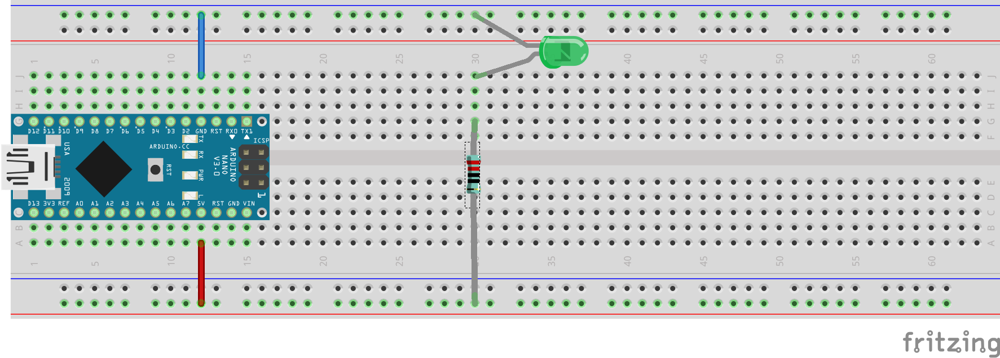

1. Übung - LED anschließen
##########################

Für diese allererste Übung brauchten wir noch nichts zu programmieren.
Wir haben einfach

- den Computer angeschaltet,
- den Arduino über das USB-Kabel mit dem Computer verbunden und dann
- das rote, blaue Kabel sowie
- den blauen Widerstand (220 Ohm) und die grüne LED

auf dem Steckbrett angebracht, wie auf folgendem Bild dargestellt ist.

Damit habt Ihr das rote Kabel mit dem 5V-Pin (also dem Pluspol) und das blaue mit dem GND (Steht für
"ground", das ist englisch für die elektrische "Masse" und ist der Minuspol).

Bei manchen Teams hat die LED sofort geleuchtet, bei anderen nicht.
Der Grund war, dass die LED falsch herum angeschlossen war.
Die Drähte der LED sind verschieden lang.
Wenn der lange Draht in Richtung 5V angeschlossen ist und der kurze an GND, dann leuchtet die LED.
Anders herum leuchtet sie nicht.

Der lange Draht ist der Anschluss der Anode, der kurze draht der Anschluss der Kathode.
