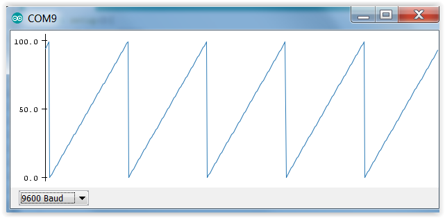

3. Übung: Text und Zahlen an Computer übermitteln
#################################################

Über die USB-Schnittstelle können Computer und Arduino auch mit einander reden. Wir tun dies hier nur in eine Richtung: Der Arduino soll dem Computer ein paar Infos rüber schicken.

Für diese Übung ist es egal, ob und welche Schaltung auf dem Steckbrett ist, da wir keinerlei Pins des Arduinos verwenden.

Unser erstes Programm schreibt zeilenweise "Hallo" auf die Konsole des Computers. Die Konsole können
wir in der Arduino-Programmierumgebung durch Menuleiste/Werkzeuge/Serieller Monitor öffnen.

.. code-block:: cpp

    void setup(){
        Serial.begin(9600);
    }

    void loop(){
        Serial.println("Hallo");
    }

Lasst uns kurz das Programm zusammen lesen. Die USB-Schnittstelle ist eine serielle Schnittstelle. In der setup-Funktion teilen wir dem Arduino mit, dass wir die serielle Schnittstelle benutzen wollen und er bitte die Kommunikation über diese beginnt. Man sagt in der Computertechnik dazu auch "man öffnet die Kommunikationsschnittstelle". Die Zahl 9600 bedeutet die Kommunikations-Geschwindigkeit in der Einheit "Zeichen pro Sekunde" . Wir könnten also 9600 einzelne Buchstaben in einer einzigen Sekunde an den Computer schicken. Nicht wenig, oder?

So, nachdem wir die Kommunikationsschnittstelle konfiguriert und geöffnet haben wie oben beschrieben, lassen wir das Programm in der loop-Funktion einfach immer wieder "Hallo" schreiben. Hallo müssen wir in doppelten Anführungszeichen schreiben, sonst würde der Compiler annehmen, dass wir eine Variable mit dem Namen Hallo meinen. Jedes Hallo bekommt seine eigene Zeile, da wir den Befehl Serial.println  benutzt haben. "print" ist ja englisch für drucken und das "ln" am Ende ist einfach die Abkürzung für "line" also auf deutsch Zeile.

Bei manchen traten beim Monitor keine oder irgendwelche seltsamen Zeichen auf und nicht die Hallos. Der Grund dafür war, dass im seriellen Monitor, also auf der Computerseite der Kommunikationsleitung nicht die selbe Geschwindigkeit (also 9600 Zeichen pro Sekunde) sondern eine andere eingestellt war. Nach Korrektur auf 9600 hat’s dann geklappt.

Als kleine Variation haben wir auch mal eine Variable heraus geschrieben, mit dem Programm wie
folgt:

.. code-block:: cpp

    void setup(){
        Serial.begin(9600);
    }

    int a = 0;
    void loop(){
        for(a = 0; a < 100; a = a + 1){
            Serial.println(a);
        }
    }

Dabei haben wir auch gleich die for-Schleife kennen gelernt. Die for-Schleife hat

- erst einen Bereich, der mit runden Klammern umgeben ist und
- danach einen Bereich mit, der von geschweiften Klammern umgeben ist.

Der erste Bereich hat drei Teile, die voneinander mit Semikolons getrennt sind.

- Der erste Teil enthält die Answeisung, die beim Eintritt in die for-Schleife ausgeführt werden soll.
- Der zweite Teil enthält die Ausführungsbedinung, also die Bedingung die erfüllt sein muss, damit (wieder) in die Schleife hinein gegangen wird. Wenn diese Bedingung nicht erfüllt ist, dann wird nicht mehr in die Schleife gegangen und das Programm geht weiter mit den Anweisungen nach der for-Schleife.
- Der dritte Teil wird nach (nicht vor!) jeder Schleife ausgeführt.

Wenn wir den seriellen Monitor uns anschauen sehen wir nun, anstelle der Hallos, Zahlen die von 0 bis 99 gehen und dann wieder bei 0 anfangen. Wenn wir den seriellen Monitor schließen und dafür den seriellen Plotter aufmachen, sehen wir die Zahlen als Graph aufgetragen. Dabei ist die y-Achse die Zahl(en), die x-Achse ist die Zeit. Diese Form nennt man übrigens "Sägezahn".
