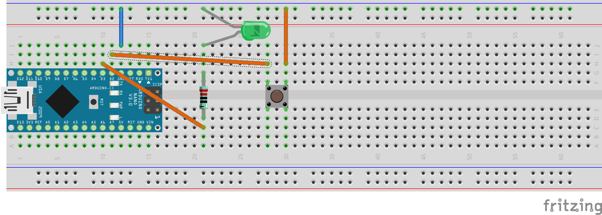

5. Übung: LED über Schalter steuern
###################################

Wir kombinieren nun vorige Schaltungen und deren Programme. Wir möchten jetzt, über den Umweg des Programmes, die LED schalten.

Während der Schalter gedrückt ist, soll die LED angeschaltet sein und umgekehrt.

Dazu stecken wir folgende Schaltung: Über den Schalter verbinden wir D2 und GND. Ein weiterer Kreis wird gebildet durch GND, die LED (Polung beachten), dem blauen 220Ohm Widerstand und D3.

Das dazugehörige Programm sieht folgendermaßen aus:

.. literalinclude:: _sources/05-led-ueber-schalter-ansteuern.cpp
    :language: cpp
    :linenos:

Wir schreiben also einfach direkt das auf Pin D3, was wir auf Pin D2 lesen.

Doch das Programm macht noch nicht genau das, was es soll. Die Logik ist noch umgekehrt. Was müssen wir machen, damit es so ist, wie am Anfang dieser Übung gefordert?
