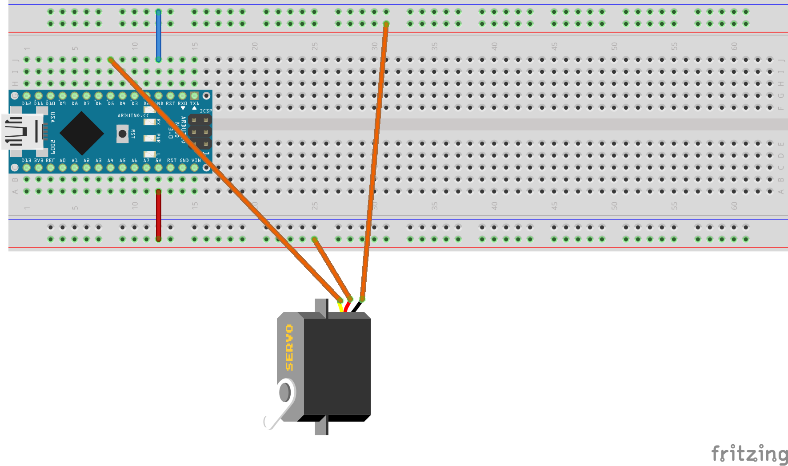

6. Übung: Servo ansteuern
#########################

Wir steuern jetzt einen Servo an. Solche Servos werden in ferngesteuerten Modellen verwendet, für die Lenkung zum Beispiel.

Den Servotyp, den wir verwenden kann Positionen zwischen 0° und 180° annehmen. Er sieht etwas anders
aus als auf der folgenden Darstellung und die Farben der drei Kabel sind anders. Zwei der Kabel
(braun und rot) dienen der Spannungsversorgung und das dritte, orange Kabel ist die Steuerleitung.
Über die Steuerleitung bekommt über Spannungspulse der Servo mitgeteilt, welchen Winkel er anfahren
soll.

Wir müssen die Kabel wie folgt mit dem Arduino (über das Steckbrett) verbinden. Dazu nehmen wir als Zwischenkabel unsere normalen Steckbrett-Kabel:

- Rotes Kabel an 5V
- Braunes Kabel an GND
- Oranges Kabel an D5

Folgendes Programm passt zu der Schaltung und bewegt jede Sekunde den Servo auf eine der Positionen
0°, 90° und 180°.

.. code-block:: cpp

    #include <Servo.h>

    Servo servo;

    void setup(){
        servo.attach(5);
    }

    void loop() {
        servo.write(0);
        delay(1000);
        servo.write(90);
        delay(1000);
        servo.write(180);
        delay(1000);
    }

Das Programm verwendet die Servo-Bibliothek. Diese Bibliothek versteckt für uns die viele Arbeit die dahintersteckt, den Servo anzusteuern. Dazu müssen wir das dazugehörige Header-File, so nennt man die Dateien mit der Endung „.h“ (wir programmieren übrigens die ganze Zeit C++), inkludieren. Noch so ein Programmier-Fachwort.

Dann legen wir eine Variable mit dem Namen servo und vom Typ Servo (letzteres hat ein großes ‚S‘. an. Mittels servo.attach(5) sagen wir der Bibliothek, dass wir den Servo an Pin 5 angeschlossen haben. Nun können wir einfach durch servo.write(winkel) verschiedene Winkel ansteuern.

Weitere Übung: Ändert doch mal obiges Programm ab, in dem ihr die Variable int winkel einführt und in den Schreibebefehlen benutzt.
