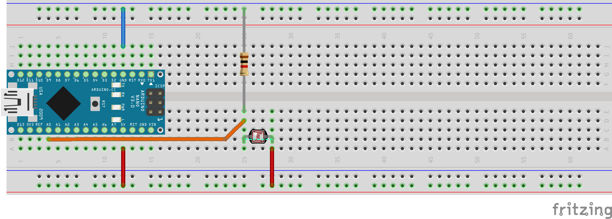

8. Übung: Lichtsensor benutzen
##############################

Mit dem Lichtsensor können wir die Helligkeit messen.

Wir stecken folgende Schaltung: GND, der braune 1000Ohm Widerstand, der Lichtsensor und der 5V-Pin bilden einen Kreis. Wir stecken ein weiteres Kabel mit dem einen Ende an den Pin A0 und dem anderen zwischen den Widerstand und dem Lichtsensor.

Das folgende Programm gibt die Helligkeitswerte auf der seriellen Schnittstelle aus.

.. literalinclude:: _sources/08-lichtsensor-benutzen.cpp
    :language: cpp
    :linenos:

Wir betrachten auf dem seriellen Monitor und auch auf dem seriellen Plotter die Helligkeitswerte während wir den Lichtsensor mal mehr und mal weniger abdecken.

Was ist der kleinste Wert? Was ist der größte?
