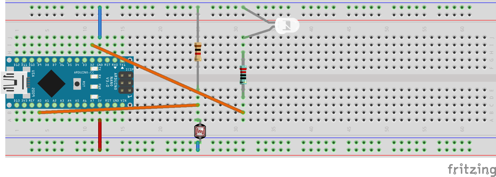

8. Übung: Lichtsensor steuert LED
#################################

Wir kombinieren nun Erkenntnisse von vorigen Übungen und lernen auch die if-Anweisung kennen.

Wir möchten nun folgendes: Die weiße LED soll leuchten, solange es zu dunkel ist. Ansonsten soll sie ausgeschaltet sein.

Die Schaltung sieht wie folgt aus:

Das dazugehörige Programm:

.. code-block:: cpp

    void setup(){
        pinMode(2, OUTPUT);
        Serial.begin(9600);
    }

    int licht = 0;
    void loop() {
        licht = analogRead(A0);

        if(licht <= 195){
            digitalWrite(2, HIGH);
        }else{
            digitalWrite(2, LOW);
    }

Serial.println(licht);
}

Mit if-Anweisung oder besser gesagt if-else-Anweisung kann man Entscheidungen und verschiedene Wege durch das Programm realisieren.

Im Programm lesen wir jede loop den Wert an A0 ein uns speichern diesen in die Variable licht. Wenn der Wert kleiner oder gleich 195 ist, dann schalten wir die LED, die an D2 ist, an. Sonst, also wenn der Wert nicht kleiner gleich 195 ist, dann schalten wir sie aus.

Zusätzlich geben wir jede loop den Wert auf der seriellen Schnittstelle aus.

Den Wert 195 haben wir übrigens ermittelt, indem wir genau die Mitte zwischen dem kleinsten und dem größten Wert, wenn wir im seriellen Plotter gesehen haben, ermittelt haben. Diesen Wert nennen wir in diesem Zusammenhang „Schwellwert“.

Übrigens: Das folgende Programm macht genau das selbe. Erkennt ihr es? Probiert es doch mal aus:

.. code-block:: cpp

    void setup(){
        pinMode(2, OUTPUT);
        Serial.begin(9600);
    }

    int licht = 0;
    void loop() {
        licht = analogRead(0);
        bool lichtAn = licht <= 195;
        digitalWrite(2, lichtAn);
        Serial.println(lichtAn);
    }
