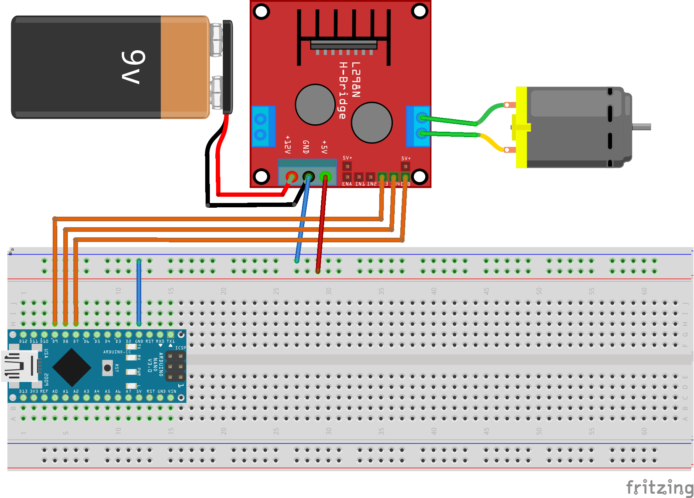

10. Übung: Abstand einlesen
###########################

.. code-block:: cpp

    // Definieren der Pins für den Ultraschallsensor
    const int trigPin = 9;
    const int echoPin = 10;

    // Skalierungsfaktor für die Kalibrierung (anpassen basierend auf Ihren Messungen)
    const float scalingFactor = 1.0; // Aktualisieren Sie diesen Wert nach der Kalibrierung

        void setup() {
            Serial.begin(9600);
            pinMode(trigPin, OUTPUT);
            pinMode(echoPin, INPUT);
        }

        void loop() {
            float entfernung = messeEntfernung();
            Serial.print("Entfernung: ");
            Serial.print(entfernung);
            Serial.println(" cm");
            delay(500);
        }

        // Funktion zur Messung der Entfernung
        float messeEntfernung() {
            long dauer;
            float entfernung;

            // Löschen des trigPin durch Setzen auf LOW
            digitalWrite(trigPin, LOW);
            delayMicroseconds(2);

            // Setzen des trigPin auf HIGH für 10 Mikrosekunden
            digitalWrite(trigPin, HIGH);
            delayMicroseconds(10);
            digitalWrite(trigPin, LOW);

            // Lesen des echoPin und Berechnen der Dauer des Impulses
            dauer = pulseIn(echoPin, HIGH);

            // Berechnen der Entfernung in Zentimetern
            entfernung = (dauer * 0.034 / 2.0) * scalingFactor;

            return entfernung;
        }
