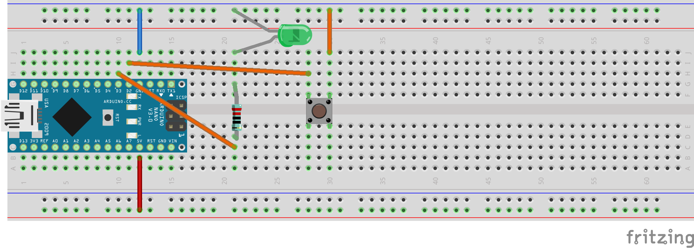

15. Übung: Toggle-Schalter mit Schalterbibliothek
#################################################

Wir möchten nun mit dem Schalter dauerhaft die LED an oder aus schalten und nicht die ganze Zeit dafür den Schalter halten müssen.

Dazu stecken wir die schon bekannte Schaltung:

Dafür müssen wir "Flanken" erkennen. So nennt man das, wenn man ein Ereignis wie

    "von gedrückt nach nicht-gedrückt" oder umgekehrt, also
    "von nicht-gedrückt nach gedrückt"

erkennen möchte. Bei einem "Ereignis" passiert immer etwas. Es ändert sich etwas. Das ist etwas anderes als ein "Zustand", wie zum Beispiel der Zustand "der Schalter ist gedrückt" oder "die Lampe ist an".

Es gibt eine gewisse Beziehung zwischen den Begriffen "Zustand", "Ereignis" und "Änderung": Ein Ereignis ist die Änderung eines Zustandes.

Um ein Ereignis zu erkennen müssen wir also den Zustand an (mindestens) zwei verschiedenen Zeitpunkten kennen. Da das Programm jedoch immer nur genau im JETZT ist, müssen wir uns also den Zustand MERKEN. Dies macht man mit einer Variablen. Diese Variable kann man dann als Zustandsvariable bezeichnen, da ihr Wert den Zustand zu einer bestimmten Zeit, die nicht die aktuelle Zeit sein muss, repräsentiert.

So, genug theoretischer Kram. All das habe ich Euch in dem komplizierten Programm gezeigt, das so
(ungefähr) aussah:

.. code-block:: cpp

    void setup() {
        Serial.begin(9600);
        pinMode(2, OUTPUT);
        pinMode(4, INPUT_PULLUP);
    }

    int s_neu = 0;
    int s_alt = 0;
    void loop() {
        s_neu = !digitalRead(4);
        if((s_alt == 0) && (s_neu == 1)){
            digitalWrite(2, 1);
        }

        Serial.println(s_neu);
        s_alt = s_neu;
    }

Und weil das so viel (komplizierter) Programmtext ist, hat jemand den in Form einer Bibliothek geschrieben, damit wir diese Bibliothek benutzen können und die Ereignisse

    der Schalter wurde gedrückt ("steigende Flanke") und auch
    der Schalter wurde losgelassen ("fallende Flanke")

ganz leicht abfragen können, ohne uns den ganzen Zustandskram selbst programmieren zu müssen. Dann
sieht das Licht-an-Licht-aus-Schalten so einfach aus:

.. code-block:: cpp

    #include "Bounce2.h"

    Bounce schalter;

    void setup() {
        Serial.begin(9600);
        pinMode(3, OUTPUT);
        pinMode(2, INPUT_PULLUP);
        schalter.attach(2);
    }

    int led = 0;

    void loop() {
        schalter.update();
        if(schalter.rose()){
            led = !led;
        }
    digitalWrite(3, led);
    Serial.println(led);
    }
