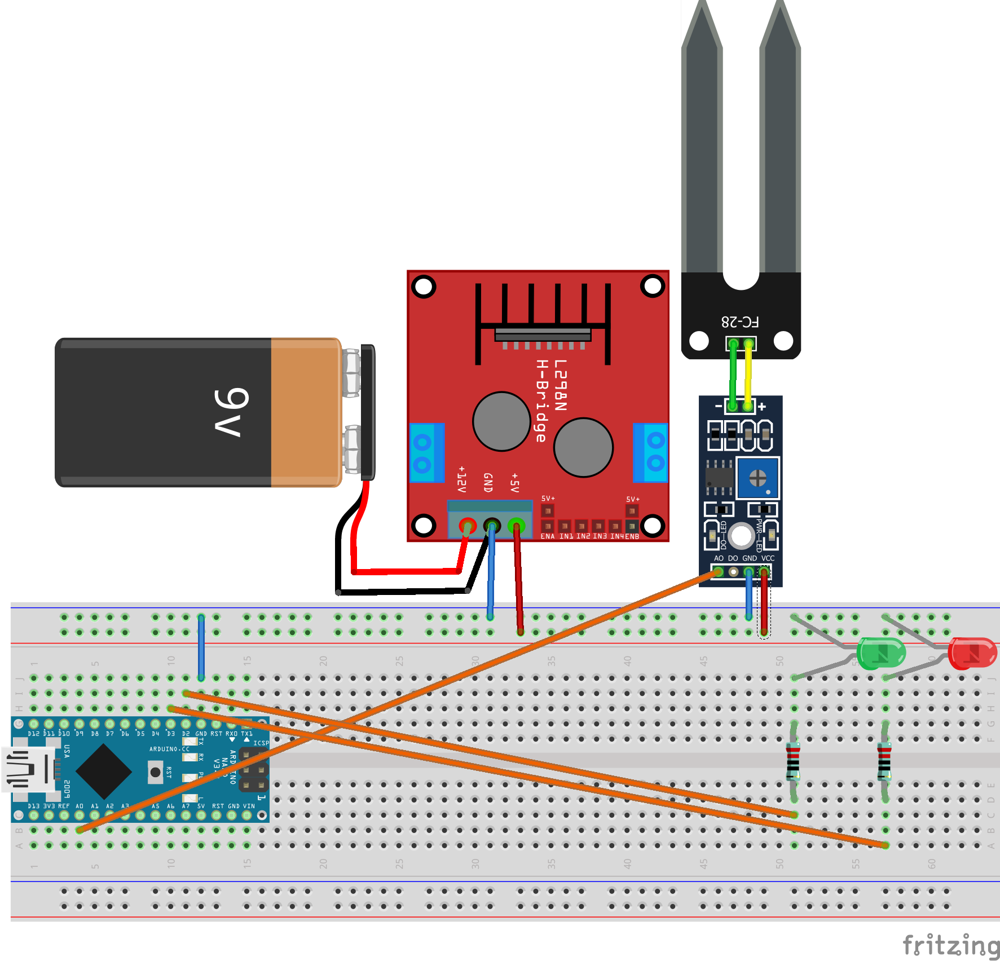

16. Übung: Elektrische Leitfähigkeit messen
###########################################

.. literalinclude:: _sources/16_elektrische_leitfaehigkeit_messen.cpp
    :language: cpp
    :linenos:

Siehe `ChatGPT-Chat <https://chatgpt.com/share/0d1eb98b-57ff-441c-bbf8-c36d782ee947>`__.
