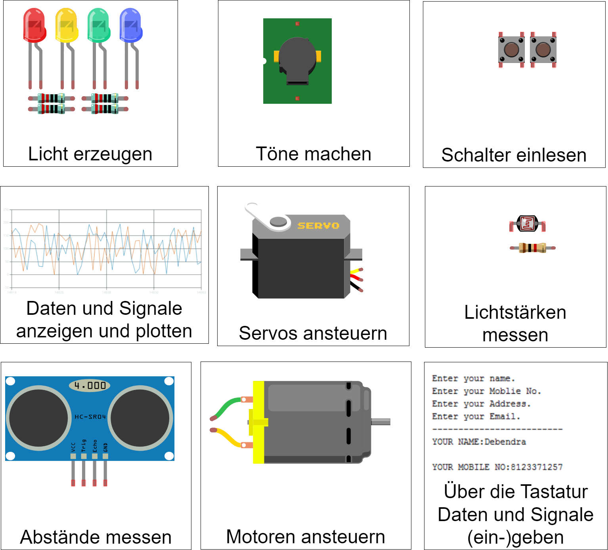

.. _sec-training-phase:

Übungensphase
#############

Während des Trainings erlernt Ihr, wie Ihr mit dem Arduino und dem Steckbrett umgeht. Dabei fangt
ihr mit einfachen Dingen an und steigert Euch hin zu komplexeren Inhalten.

Am Ende des Trainings habt Ihr einen Baukasten von Fähigkeiten, die Ihr für Eure eigenes Projekt kombinieren könnt.

    Baukasten der Fähigkeiten [#]_

.. toctree::
    :maxdepth: 1
    :hidden:

    01-led-anschliessen
    02-led-steuern
    03-infos-an-computer
    04-schalter-einlesen
    05-led-ueber-schalter-ansteuern
    06-summer-ansteuern
    07-servo-ansteuern
    08-lichtsensor-benutzen
    09-lichtsensor-steuert-led
    10-abstand-einlesen
    11-motor-betreiben
    12-motor-ansteuern
    13-daten-und-signale-an-arduino-senden
    14-auf-schalter-reagieren-egal-wo-program
    15-toggle-schalter-mit-bibliothek
    99-todos

.. rubric:: Anmerkungen

.. [#] Die mit :kbd:`VIN` gekennzeichneten Fähigkeiten benötigen eine stärkere Stromquelle, als die der Arduino selbst darstellt. Dazu benötigen wir die Erweiterung auf dem Steckbrett und die Powerbank.
