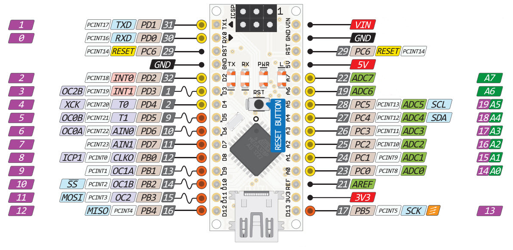

.. _sec-construction-phase:

Konstruktionsphase
##################

Die Position von Servos und die Geschwindigkeit von Motoren wird über deren Eingangsspannung eingestellt. Der Arduino kann die Spannung eines Ausgangs über eine sogenannte Puls-Weiten-Modulation (PWM) zwischen 0V und 5V variieren. Nur die Pins 3, 5, 6, 9, 10, 11 können eine PWM, die anderen können nur eingeschaltet (Spannung gleich 5V) oder ausgeschaltet (Spannung gleich 0V) sein. Die Kurven-Symbole im :ref:`fig-arduino-pinout` bedeuten "kann auch PWM".

.. _fig-arduino-pinout:

    Arduino Nano v3 Pinout
