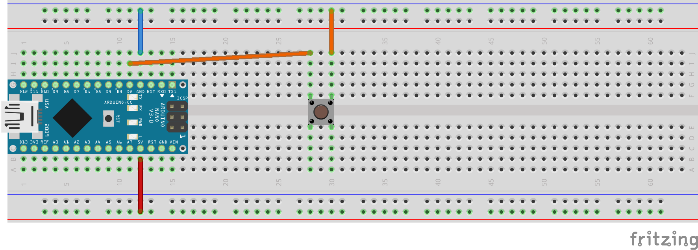

4. Übung: Schalter einlesen
###########################

Wir stecken die auf dem folgenden Bild gezeigte Schaltung. Während der Schalter gedrückt ist, verbindet er Pin D2 mit GNG (Ground). Während der Schalter nicht gedrückt ist, ist der D2 offen.

Folgendes Programm tippen wir ein und laden es auf den Arduino.

.. code-block:: cpp

    void setup(){
        Serial.begin(9600);
        pinMode(2, INPUT_PULLUP);
    }

    void loop() {
        int schalter = digitalRead(2)
        Serial.println(schalter);
    }

Wir schauen uns auf dem seriellen Monitor und auch auf dem seriellen Plotter an was passiert, wenn wir mit dem Schalter spielen. Wir sehen eine 1 während der Schalter unbetätigt ist; während wir ihn gedrückt halten sehen wir eine 0.

Wir modifizieren das Program, indem wir ein Ausrufezeichen zwischen die öffnende Klammer und das digitalRead einsetzen.

Nach Hochladen des Programmes ist es mit Zahlen und Betätigen umgekehrt.

